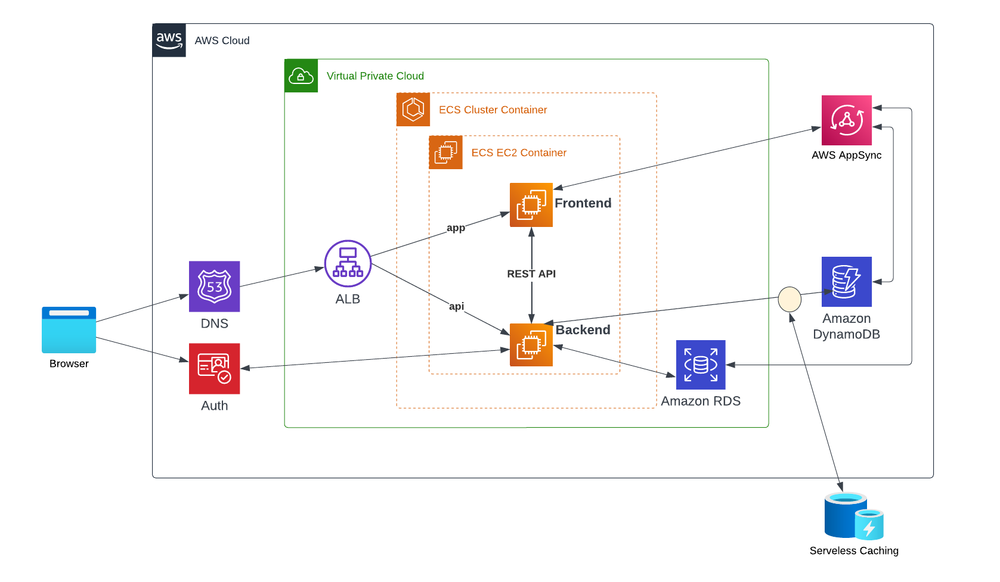

# Week 0 — Billing and Architecture

## Setting up the AWS CLI on a Gitpod workspace
The purpose of this configuration is to have a ready AWS CLI every time the workspace is launched.

### Install AWS CLI
The following configuration will download, install and set up the AWS CLI in each new session created for this Gitpod workspace. Update the file `.gitpod.yml` to include the following task:

```yaml
tasks:
  - name: aws-cli
    env:
      AWS_CLI_AUTO_PROMPT: on-partial
    init: |
      cd /workspace
      curl "https://awscli.amazonaws.com/awscli-exe-linux-x86_64.zip" -o "awscliv2.zip"
      unzip awscliv2.zip
      sudo ./aws/install
      cd $THEIA_WORKSPACE_ROOT
```
**References**
- https://docs.aws.amazon.com/cli/latest/userguide/getting-started-install.html
- https://docs.aws.amazon.com/cli/latest/userguide/cli-usage-parameters-prompting.html
- https://www.gitpod.io/docs/configure/workspaces/tasks

### Set environment variables

To have the environment variables available in each session created for the Gitpod workspace, you have to set all variables with the commmand `gp env` like the following:
```sh
gp env AWS_ACCESS_KEY_ID=""
gp env AWS_SECRET_ACCESS_KEY=""
gp env AWS_DEFAULT_REGION=us-east-1
```

Once you have all set go ahead and launch a new workspace from the same Github project. Now you can see at the launching all the installation and configuration going on.

** You have to create the user credentials on AWS IAM as a prerequesite for the previous instructions.

**References**
- https://www.gitpod.io/docs/configure/projects/environment-variables


### Check that the AWS CLI is working and you are the expected user

```sh
aws sts get-caller-identity
```

You should see something like this:
```json
{
    "UserId": "AIFBZRJIQN2ONP4ET4EK4",
    "Account": "655602346534",
    "Arn": "arn:aws:iam::655602346534:user/andrewcloudcamp"
}
```

## Creating a Billing Alarm

### Create SNS Topic

- We need an SNS topic before we create an alarm.
- The SNS topic is what will delivery us an alert when we get overbilled

We'll create a SNS Topic
```sh
aws sns create-topic --name billing-alarm
```
which will return a TopicARN

We'll create a subscription supply the TopicARN and our Email
```sh
aws sns subscribe \
    --topic-arn TopicARN \
    --protocol email \
    --notification-endpoint your@email.com
```

Check your email and confirm the subscription

** We need to turn on Billing Alerts to recieve alerts. In your Root Account go to the `Billing Page`, and under `Billing Preferences`, choose `Receive Billing Alerts`. Afer that click on `Save Preferences`.

**References**
- https://docs.aws.amazon.com/cli/latest/reference/sns/create-topic.html

#### Create Alarm

- We need to update the configuration json script with the TopicARN we generated earlier
- We are just a json file because --metrics is is required for expressions and so its easier to us a JSON file.

```sh
aws cloudwatch put-metric-alarm --cli-input-json file://aws/json/alarm_config.json
```

**References**

- https://docs.aws.amazon.com/cli/latest/reference/cloudwatch/put-metric-alarm.html
- https://aws.amazon.com/premiumsupport/knowledge-center/cloudwatch-estimatedcharges-alarm
 
## Create an AWS Budget

Get your AWS Account ID
```sh
aws sts get-caller-identity --query Account --output text
```

- Supply your AWS Account ID
- Update the json files
- This is another case with AWS CLI its just much easier to json files due to lots of nested json

```sh
aws budgets create-budget \
    --account-id AccountID \
    --budget file://aws/json/budget.json \
    --notifications-with-subscribers file://aws/json/budget-notifications-with-subscribers.json
```

**References**
- https://docs.aws.amazon.com/cli/latest/reference/budgets/create-budget.html


### Recreate Conceptual Diagram
![Cruddur Conceptual Design](assets/Cruddur Project - Conceptual diagram.png

### Recreate Logical Architectural Diagram


